# Understanding Semantic Image Segmentation with U-Net

This project aims to explore the concept of Semantic Image Segmentation using the U-Net architecture. Semantic segmentation is a critical task in computer vision that involves classifying each pixel in an image to a specific class. U-Net, a type of Convolutional Neural Network (CNN), is particularly effective for this task due to its ability to capture context and localization information.

## Introduction

Our objective is to explore the inner workings of the U-Net model by examining the feature maps generated at different stages of the network. We dissect the encoding, decoding, skip connection, and activation layers to gain insights into how the model learns to segment images pixel-wise. By visualizing the feature maps at each step, we aim to unravel the intricate process by which U-Net performs semantic segmentation, shedding light on its ability to accurately delineate objects and regions of interest within an image. Through this exploration, we seek to enhance our understanding of semantic segmentation and its practical applications in computer vision tasks.

## Resources and Tools

For this project, we used the Kitti Semantic RGB dataset for training the U-Net model. The dataset consists of 200 labeled images, out of which 140 images were used for the training set and 60 images were used for the validation set. The U-Net model was trained to classify images into a total of 30 classes.

The U-Net model was compiled using the Adam optimizer with a learning rate of 0.001. The loss function used was sparse categorical crossentropy, which is suitable for multi-class classification tasks. The model's performance was evaluated using the Mean Intersection over Union (Mean IoU) metric. Mean IoU is a popular metric for semantic segmentation tasks, defined as the average of the ratio of the area of overlap and the area of union between the predicted and actual classes across all classes. The Mean IoU was implemented using a custom Keras metric, `SparseMeanIoU`, which extends Keras' `MeanIoU` to handle sparse labels. 

Once the model was trained, we extracted the features of each layer. This allowed us to examine the feature maps generated at different stages of the network, providing insights into the inner workings of the U-Net model.

The full training report can be found [here](link).

- Training pipeline is adapted from [ika-acdc-notebooks](https://github.com/ika-rwth-aachen/acdc-notebooks/tree/8afe3197db454e2aabd381fb5fc7d22a98f2b23f)
- Feature map extraction code is inspired by this [blog](https://machinelearningmastery.com/how-to-visualize-filters-and-feature-maps-in-convolutional-neural-networks/)
- Dataset: [Kitti Semantic Dataset](https://www.cvlibs.net/datasets/kitti/eval_semseg.php?benchmark=semantics2015)
- Model: U-Net, as described in this [paper](https://lmb.informatik.uni-freiburg.de/people/ronneber/u-net/)

## Model Architecture

U-Net is a widely used architecture for semantic segmentation which was originally used in medical image segmentation. The architecture follows an encoder-decoder structure and incorporates skip connections to merge the low-level detailed feature maps produced by the encoder with the corresponding high-level semantic feature maps generated by the decoder. The architecture is structured as follows:

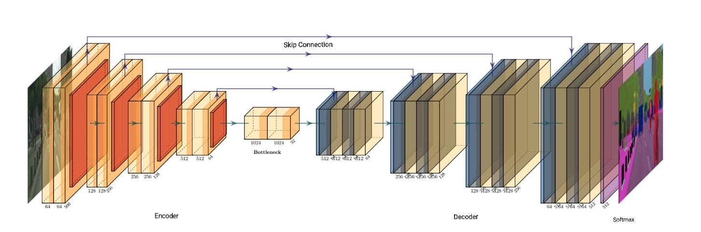
Source: ika, [PlotNeuralNet](https://github.com/HarisIqbal88/PlotNeuralNet)

## Illustrating Feature Maps in Different Stages of U-Net Inferencing

To gain insights into the inner workings of the U-Net model, we will now illustrate the feature maps generated at different stages of the network during the inferencing process. We will use the image below from the Kitti Semantic RGB dataset to visualize the feature maps and analyze how the model learns to segment images pixel-wise.

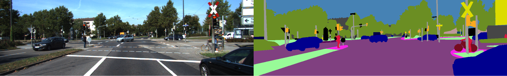
Source: [Kitti Semantic Dataset](https://www.cvlibs.net/datasets/kitti/eval_semseg.php?benchmark=semantics2015)

## Encoder

The encoder section comprises a series of consecutive operations. Firstly, it involves the application of two 3x3 convolutions without padding, followed by a rectified linear unit (ReLU) activation function. Subsequently, a 2x2 max-pooling operation with a stride of 2 is applied to downsample the feature maps. Notably, at each downsampling step, the number of feature channels is doubled.

The input RGB image is fed into the encoder starting with 16 filters. U-Net depth for this project was 5, which means at the end of the encoder layer a total of 256 feature channels were created. 

The following section visualizes each downsampling step to illustrate what the encoder section captures. 

### Step-1 (Conv2d_1 layer):

The first convolutional layer, Conv2d_1, serves as the initial stage in feature extraction, where raw pixel information is transformed into higher-level representations. Through visualization, it becomes evident that different feature maps within this layer exhibit specialized responses to various aspects of the input image. For instance, channel 3 detects sharp edges, channel 8 highlights object contours, channel 7 focuses on vegetation regions, and channel 16 delineates large-scale structures and nuanced features.

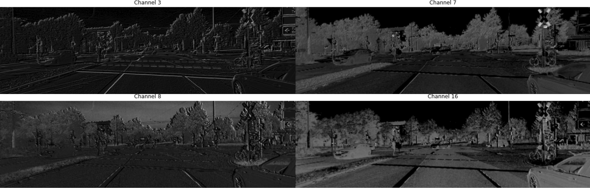

### Step-2 (Conv2d_3 layer):
The Conv2d_3 layer shows a refinement in feature detection, indicating a progression towards more abstract representations. Channels 6 and 14 exhibit enhanced refinement, while channels 3 and 25 detect horizontal and vertical lines respectively, demonstrating the network's ability to capture diverse visual elements.

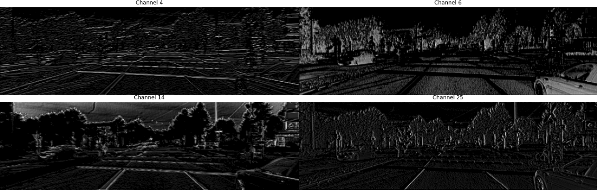

### Step-3 (Conv2d_5 layer):
The Conv2d_5 layer further refines and abstracts features, indicating the network's progression towards sophisticated representations. Feature maps in this layer demonstrate sensitivity to complex visual patterns and structures. For example, channel 11 detects sharp lines originating from the left side of objects, channel 40 detects tree textures, and channel 63 identifies bicycle and car tire structures.

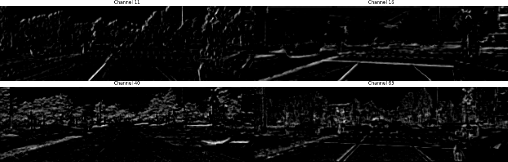

### Step-4 (Conv2d_7 layer):

The Conv2d_7 layer provides a deeper level of abstraction, continuing the trend of progressing towards more abstract representations of the input image.

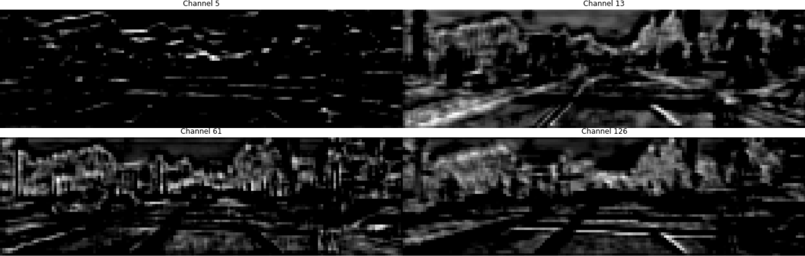

### Step-5 (Conv2d_9 layer):

The Conv2d_9 layer, being the final layer of the encoder, provides the highest level of abstraction, capturing the most complex and abstract features of the input image.

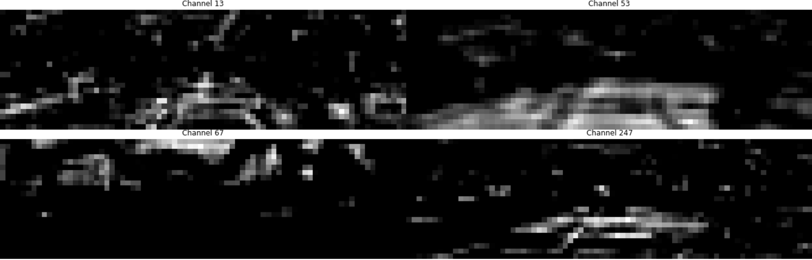

## Decoder

In the expansive path, each step involves an upsampling of the feature map followed by a 2x2 convolution (referred to as "up-convolution") that reduces the number of feature channels by half. Subsequently, the result is concatenated with the correspondingly cropped feature map from the contracting path. Finally, two 3x3 convolutions are applied, each followed by a Rectified Linear Unit (ReLU) activation function.

So, 256 feature channels are converted to 16 channels by the end of the decoder. Below are the outputs of each of the decoder steps-

### Step-1 (Conv2d_11 layer):

Upon transitioning to the decoder layers, it signifies the network's integration of encoded information with the task of image reconstruction. Notably, channels such as 25 and 68 exhibit a propensity for detecting features in the upper regions of the image, while channel 28 demonstrates a focus on features within the lower half. Additionally, channel 52 emerges as a notable detector of overall image contours, indicative of the network's ability to encapsulate global image characteristics.

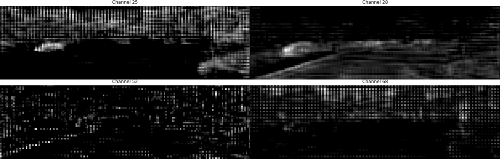

### Step-2 (Conv2d_13 layer):

Building upon the insights gleaned from the preceding layer, this stage demonstrates a further refinement in segmenting the upper and lower halves of the image, with increased granularity and precision. Notably, channels 3 and 17 excel in accurately detecting all five vehicles present in the scene, while channel 34 adeptly identifies vertical poles. Channel 30 emerges as a standout feature detector, proficiently segmenting the upper half of the image while encompassing all five cars within its scope.

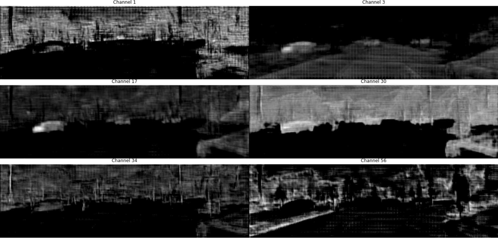

### Step-3 (Conv2d_15 layer):

At the third step, we see some feature merging from the previous step. For example, channel 2 adds the vertical poles info along with the upper half details. Channel 7 gives lower half with added details of road markings. Channel 16 adds poles information with lower half detection. Channel 17 gives a much detailed abstract view of the overall section.

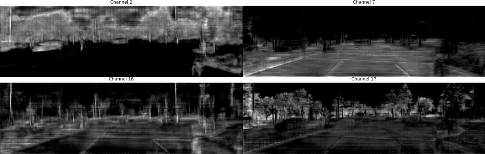

### Step-4 (Conv2d_17 layer):

On the final Decoder layer, we see some more detailed features. For example, in channel 16 we can see detection of electric cables.

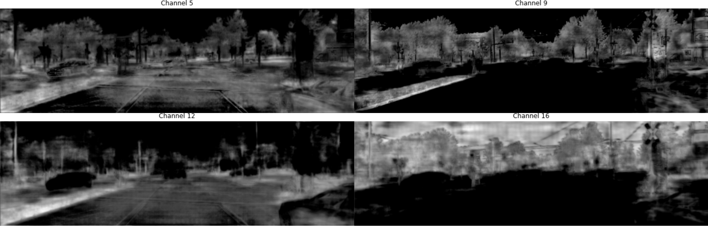

## Skip Connection

Before moving on to the softmax layer, it's important to understand the role of skip connections. After each encoder layer, the filters are stored and finally added with the corresponding decoder layer, defined by the concatenate layers. If we look into the feature maps of the `conv2d_transpose_3` layer below, we can see it has lost much information. 

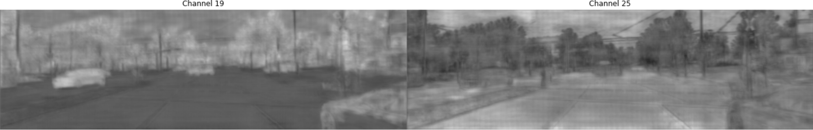

This is where skip connections come into play, helping to retain the lost information and improve the performance of the network. For example, 16 feature maps stored during conv2d_1 step are added here with the 16 features from conv2d_transpose_3 to recover lost information. Some feature maps from the conv2d_1 are shown below-

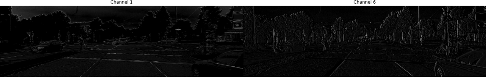

## Activation Layer

At the final layer, a 3x3 convolution is employed to transform each 16-component feature vector into the required number of classes, in this case, 30 classes. In total, the network comprises 23 convolutional layers. Below are some feature maps from the final convolutional layer:

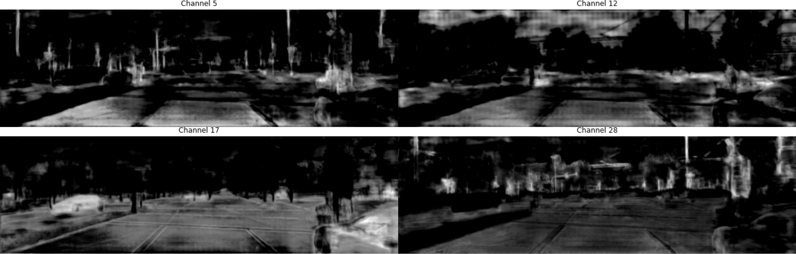

A softmax activation is finally applied on the 30 final feature maps resulting in a probability distribution over the classes. Here's how the softmax activation works in this scenario:

1. For each pixel location in the image, the segmentation model produces 30 logits, one for each class. These logits represent the model's confidence scores for each class at that pixel location.
2. The softmax activation function is applied independently to the logits at each pixel location. For each pixel, the softmax function computes the exponential of each logit, then normalizes these values by dividing by the sum of all exponentials.
3. After applying softmax to each pixel's logits, the result is a probability distribution over the 30 classes for that pixel. Each value in the resulting probability distribution represents the model's estimated probability that the pixel belongs to the corresponding class.
4. The output of the softmax activation at each pixel location forms a segmentation map, where each pixel is assigned a probability distribution over the 30 classes. Typically, the class with the highest probability at each pixel is chosen as the predicted class label for that pixel during inference.

The image below displays the 7th channel of the activation layer output, corresponding to the class ID 6, denoting "Car". Despite imperfections in detection, the model successfully identifies all five cars in the image.

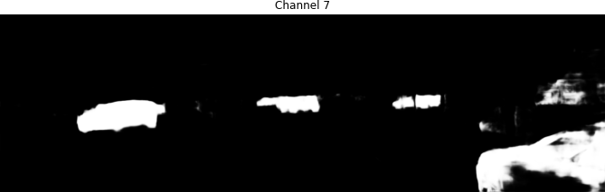

Channels 1, 21, and 24 correspond to the class identifiers for Road, Pole, and Vegetation, respectively. The model effectively detected these larger objects. However, it had difficulties detecting smaller objects, such as instances of the Person class in Channel 5.

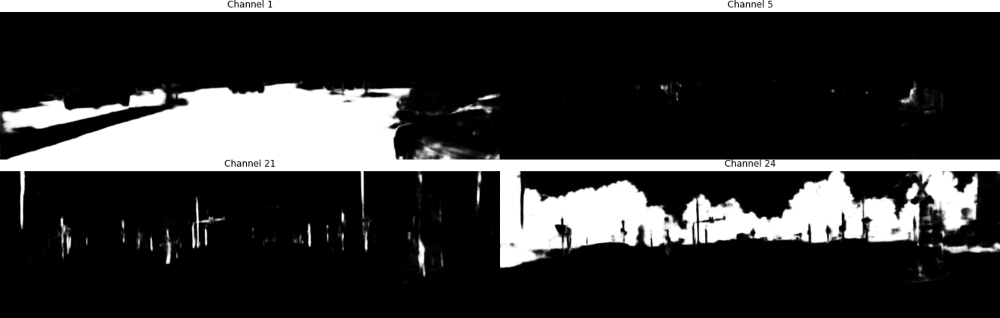

## Conclusion

In conclusion, this project demonstrated the potential of U-Net for image segmentation tasks. Note, The main goal of this project was to explore U-Net's functionality, not to fine-tune the model. While there is room for improvement, particularly in detecting smaller objects, the results provide a promising starting point for further exploration.

All the feature maps used in this project can be found in the [feature_maps](https://github.com/khsafkatamin/semantic-image-segmentation-unet/tree/main/assets/feature_maps).

The trained model is saved in the [saved_model](https://github.com/khsafkatamin/semantic-image-segmentation-unet/tree/main/saved_model/model).

